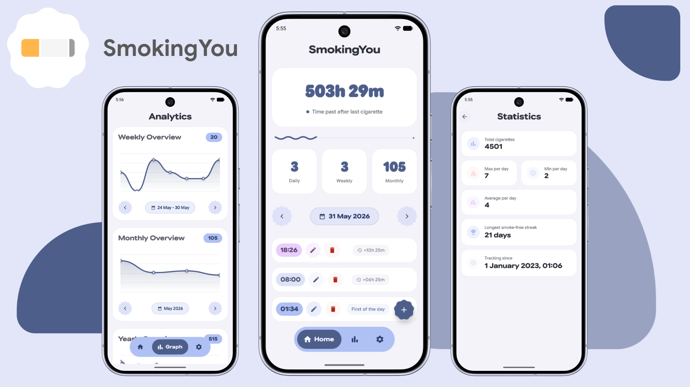
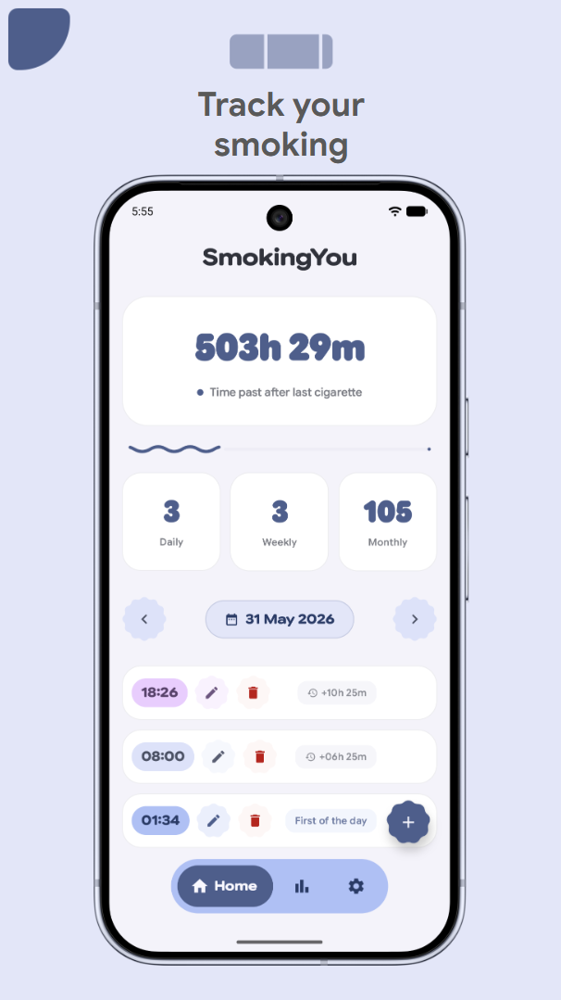
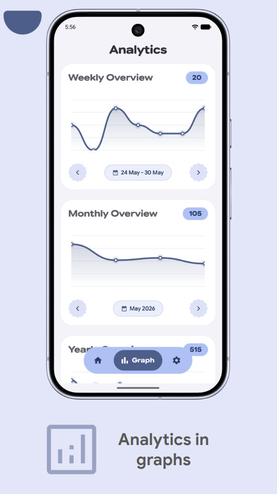
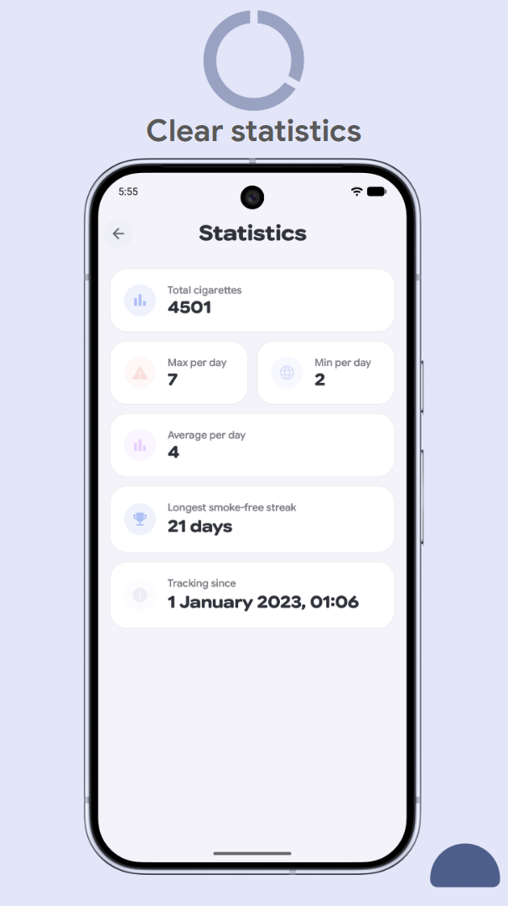
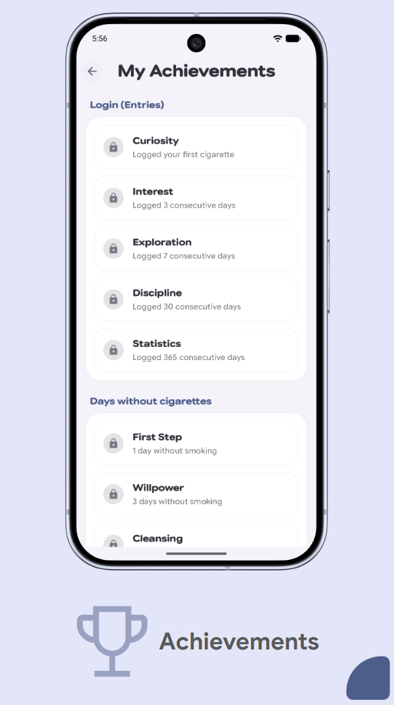

  

  # SmokingYou

  Minimalist, data-oriented smoking tracker for Android based on Material 3 Expressive.

  

    
    
    
    
    
  

  

    
  

  

    
  

---

SmokingYou is designed to help you track and manage your smoking habits. By offering clear statistics, dynamic charts, and motivational achievements, the app provides the insights needed to cut down or quit entirely.

## Screenshots

  
  

## Features

- **Habit Tracking:** Log entries with a single tap. A real-time timer displays the duration elapsed since your last cigarette.
- **Detailed History:** View, edit, or delete past logs.
- **Analytics:** Visualize daily and weekly patterns using interactive charts.
- **Statistics:** Track total count, averages, daily extremes, and your longest smoke-free streak.
- **Achievements & Notifications:** Stay motivated with milestone badges for consistency and smoke-free intervals, with instant local notifications on unlock.
- **Daily Limit:** Define a daily cigarette limit to monitor consumption.
- **Data Portability:** Local backup and restore (JSON export/import) to secure your logs.
- **Highly Customizable Themes:**
  - Standard Light, Dark, and System themes.
  - **AMOLED Dark Mode** for extra power saving.
  - **Dynamic Colors (Material You)** matching system wallpaper on Android 12+.
  - Curated color presets (Classic, Sage, Rose, Ocean, Lavender).
  - Custom font presets.
  - **Dynamic App Icons** (change the app icon directly from settings).

## Tech Stack

- **Language:** [Kotlin](https://kotlinlang.org/) (Coroutines, Flow)
- **UI Framework:** [Jetpack Compose](https://developer.android.com/jetpack/compose) with Material 3 Expressive
- **Data Persistence:** 
  - [Room Database](https://developer.android.com/training/data-storage/room) — for secure local storage of logs and history.
  - [Jetpack DataStore](https://developer.android.com/topic/libraries/architecture/datastore) — for settings and configuration parameters.
  - GSON — for data backup serialization.
- **Dependency Injection:** [Koin](https://insert-koin.io/) — lightweight dependency injection framework.

## Localization

Currently supported languages:
- English
- Russian
- German
- Spanish
- French
- Italian
- Portuguese
- Turkish
- Ukrainian
## Installation

1. Download the latest APK from the [Releases](https://github.com/mem2sp/SmokingYou/releases/latest) page.
2. Ensure installation from unknown sources is allowed in your Android settings.
3. Install the APK on your device.

## Special Thanks

Special thanks to the following projects for design ideas and inspiration:
- **[Tomato](https://github.com/nsh07/Tomato)** and **[Zenith](https://github.com/1372Slash/Zenith)** - For beautiful interface concepts and inspiration, Material 3 Expressive guidelines implementation ideas and design inspiration.

## Contributing

Contributions are welcome. If you find a bug or have a feature suggestion, please open an issue or submit a pull request.
